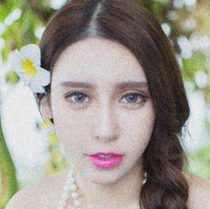
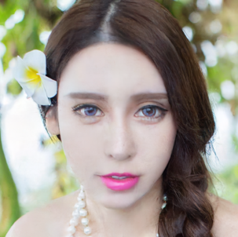
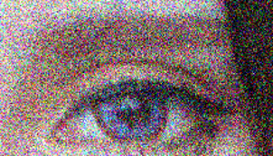
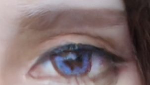
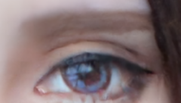

# Degraded-diff — Degradation-aware Conditional Diffusion for Face Image Restoration

劣化情報（劣化タイプ + 劣化パラメータ）を推定し、拡散モデルの復元過程をガイドすることで、劣化顔画像の復元精度を向上させる研究実装です。

- 劣化推定：劣化タイプ分類 / ノイズσ推定 / モーションブラー（length, angle）推定
- 条件付け：推定結果をテキスト化 → CLIP(ViT-B/32)で埋め込み → Cross-Attentionで拡散モデルへ統合
- 評価：PSNR / SSIM（w/o degradation info との比較）

---

## Repository Structure

- `configs/ffhq.yml` : diffusion 学習・復元用 config
- `train_diffusion.py` : diffusion model の学習（`configs/<name>.yml` を読み込む）
- `eval_diffusion.py` : 復元（推論/評価）
- `train_degradation_type_predictor.py` : 劣化タイプ分類器の学習
- `train_noise_predictor.py` : ノイズσ推定器の学習
- `train_blur.py` : ブラー(length, angle)推定器の学習
- `datasets/` / `models/` / `utils/` : dataloader / model / utilities

---

## Quick Start（最短で動かす）

### 0) Install

```bash
pip install torch torchvision pyyaml numpy opencv-python matplotlib
```

### 1) Configの確認（重要）

Diffusion用 config は `configs/ffhq.yml` を使います。  
この config にはデータセットパスが **Windowsの絶対パス**で書かれているため、必ず自分の環境に合わせて変更してください。

- `configs/ffhq.yml` の `data.data_dir` を変更（例：`./datasets/data/ffhq` など）
- 現状の例：`C:/Users/.../datasets/data/ffhq`

### 2) Train Diffusion

```bash
python train_diffusion.py --config ffhq.yml
```

### 3) Restore / Evaluate

（diffusionのチェックポイントを指定）

```bash
python eval_diffusion.py --config ffhq.yml --resume <PATH_TO_DIFFUSION_CKPT> --test_set ffhq
```

## Results

### Degradation Estimation

| Task | Metric | Result |
|---|---:|---:|
| Degradation type estimation | Accuracy ↑ | **100.00%** |
| Noise level estimation | RMSE ↓ | **0.50** |
| Motion blur length estimation | MSE ↓ | **0.008** |
| Motion blur angle estimation | MSE ↓ | **0.004** |

### Restoration（PSNR / SSIM）

以下は **w/o degradation info** と **提案手法（ours, conditional）** の比較例です。

<!-- Noise / Global (4 images in 1 row) -->
<p align="center">
  
  
  
  
</p>
<p align="center">
  <b>Conditional</b> &nbsp;&nbsp; <b>w/o Degradation Info</b> &nbsp;&nbsp; <b>Ours</b> &nbsp;&nbsp; <b>GT</b>
</p>

<!-- Noise / Zoom (4 images in 1 row) -->
<p align="center">
  
  
  
  
</p>
<p align="center">
  <b>Conditional (Zoom)</b> &nbsp;&nbsp; <b>w/o (Zoom)</b> &nbsp;&nbsp; <b>Ours (Zoom)</b> &nbsp;&nbsp; <b>GT (Zoom)</b>
</p>

| Degradation | PSNR (w/o) | SSIM (w/o) | PSNR (ours) | SSIM (ours) |
|---|---:|---:|---:|---:|
| Noise | 34.42 | 0.878 | **36.13** | **0.903** |
| Motion blur | 33.78 | 0.911 | **35.21** | **0.917** |
| Downsample | 33.12 | 0.892 | **34.16** | 0.890 |

---

